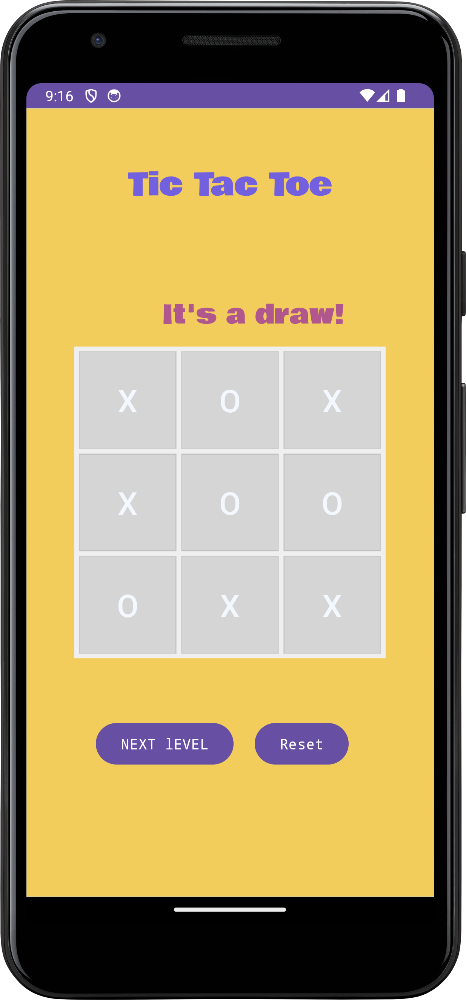

# Tic-Tac-Toe Android App

This Android application is a simple implementation of the classic Tic-Tac-Toe game.

## Features

- Play the classic Tic-Tac-Toe game on your Android device.
- Switches between Player X and Player O turns.
- Keeps track of wins for both players.
- Reset the game board and scores for a new game.

## How to Play

1. Open the app on your Android device.
2. The game starts with Player X or Player O, selected randomly.
3. Tap on the buttons in the grid to place your mark (X or O).
4. The first player to get three of their marks in a row (horizontally, vertically, or diagonally) wins the game.
5. If all cells are filled and no player achieves three marks in a row, the game results in a draw.
6. Use the "New Game" button to start a new game.

## Screenshots

[Add screenshots of your app here if available]

